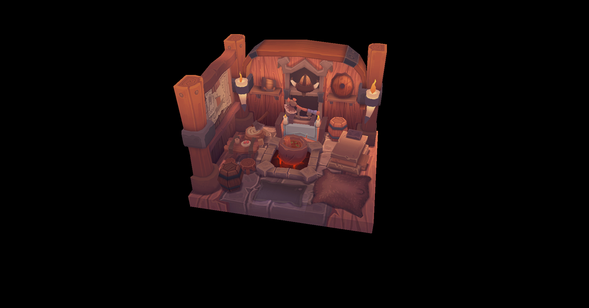

# Vulkan renderer

A little project I have been working on while learning
Vulkan graphics API. I mostly followed [Vulkan Tutorial](https://vulkan-tutorial.com/)
while rewriting and abstracting code by myself as much as possible.

## Features
Currently, can renderer a single 3D mesh loaded from 
.obj file or defined as vertices and indices.

## Planned features
- Abstraction of the rest of code into classes
- Loading and rendering multiple meshes
- Simple Blinn-Phong lighting
- MSAA or other simple AA method

## License
[MIT](https://choosealicense.com/licenses/mit/)